# From Idea to Deployment: Surya Yantra Development Journey

*Friday weekly angle — Publication-ready polish + ideation→implementation diagram*

This document traces how Surya Yantra progressed from a gap in the open-source
PV tooling landscape to a live, IEC-compliant testing platform.

---

## Flowchart

```mermaid
flowchart TD
    A["💡 Research Idea\n──────────────\nGap: no open-source, browser-deployable\nIEC 60891 correction library exists\nfor Indian PV labs"] --> B

    B["📚 Standards Study\n──────────────\nIEC 60891:2021 — 4 correction procedures\nIEC 60904-7:2019 — spectral mismatch factor\nIEC 61853-2:2016 — incidence-angle modifier"] --> C

    C["🔢 Algorithm Design\n──────────────\nP1–P4 formulas extracted from standard\nSMMF: trapezoidal integration on union grid\nIAM: Martin-Ruiz model, ar=0.17 default\nPipeline order: IAM → SMMF → IEC 60891"] --> D

    D["⚙️ TypeScript Implementation\n──────────────\nlib/iec60891.ts · lib/smmf.ts · lib/iam.ts\nZero external math dependencies\nAbsolute α/β in functions; %/°C stored in DB\nModuleParams interface with optional Rsh"] --> E

    E["🧪 Test Suite\n──────────────\n46 Vitest tests — jsdom + Testing Library\nAll procedures validated vs §1.5 worked example\nSMMF grid-union edge cases\nIAM reference table spot-checks"] --> F

    F["🌐 REST API Layer\n──────────────\nNext.js 14 App Router routes\nPrisma ORM + PostgreSQL 15\nRFC 7807 problem+json error shape\nHMAC-signed bearer tokens"] --> G

    G["📡 Real-Time Streaming\n──────────────\nSocket.IO WebSocket, one event per IV point\nuseIVStream hook + ring buffer 5 000 pts\nLiveIVChart — Recharts, animation disabled\n200 pts/s · 60 fps · sub-50 ms LAN latency"] --> H

    H["🔌 Hardware Integration\n──────────────\nESL-Solar 500 SCPI via USB/Ethernet\n300-relay MUX matrix, STM32H7 + MCP23017\n75 modules, 4-wire Kelvin, 0–300 V / 27 A\nFirmware + server-side safety interlocks"] --> I

    I["☁️ Deployment\n──────────────\nVercel web app — sin1 region\nElectron 30 standalone .exe for lab PC\nCloudflare Tunnel — SCPI relay bridge\nPrisma migrate deploy on every build"] --> J

    J["✅ Validation\n──────────────\nP1 vs P2: ≤0.4% at ΔG < 200 W/m²\nVercel latest deployment: READY\n46 / 46 tests passing\nAI diagnostics — claude-opus-4-8"] --> K

    K["📄 Research Output\n──────────────\nMIT licence on GitHub\ndocs/: API + IEC-CORRECTIONS + HARDWARE-SETUP\nposts/2026-06-06-iec60891-open-source.md\nTarget: IEEE Journal of Photovoltaics"] --> L

    L{Next steps}

    L -->|Journal track| M["IEEE JPHOTOV submission\nTarget Q3 2026\nBlocker: §4 real lab dataset"]

    L -->|Community track| N["GitHub Release v1.0\nSrishti PV Lab announcement\nContributor guidelines"]

    L -->|Engineering track| O["packages/scpi-client — missing\nhardware/schematics/ — missing\n.env.example — missing\nStreaming relay service — missing"]

    O -->|Next sprint seed| A
```

---

## Stage-by-Stage Decision Log

| Stage | Key decision | Rationale |
|-------|-------------|-----------|
| Algorithm Design | P2 as default for outdoor measurements | Jamnagar ΔG up to 600 W/m²; P1 valid only at ΔG ≤ 200 W/m² |
| Implementation | TypeScript, zero math dependencies | Runs in browser, Node.js, and Vercel Edge without bundling issues |
| Implementation | Absolute α/β in lib functions | Separation: DB stores manufacturer spec (%/°C); physics uses A/°C |
| Test suite | Vitest over Jest | Next.js 14 / ESM ecosystem alignment; faster cold start |
| API errors | RFC 7807 problem+json | Machine-readable shape required for SolarLabX webhook integration |
| Streaming | Socket.IO over raw WebSocket | Auto-reconnect, HTTP long-poll fallback, room namespacing |
| Deployment | Cloudflare Tunnel for lab bridge | Free; no inbound firewall hole; no static IP required |
| Deployment | Vercel sin1 region | Lowest latency from Jamnagar; Mumbai bom1 not yet on Edge network |

---

## Open Gaps → GitHub Issues

| Gap | Priority | Status |
|-----|----------|--------|
| Real IV dataset for §4 Results | P1 — blocks journal submission | Issue to be filed |
| `packages/scpi-client` absent | P1 — blocks lab deployment | Issue to be filed |
| `hardware/schematics/` SVGs absent | P2 — blocks hardware review | Issue to be filed |
| `.env.example` missing | P2 — blocks new-contributor onboarding | Issue to be filed |
| `docs/PRD.md` referenced but absent | P3 | Issue to be filed |
| GitHub Actions CI/CD not configured | P2 | Issue to be filed |
| Relay service `apps/desktop/relay` unimplemented | P1 — blocks cloud→lab bridge | Issue to be filed |

---

*Generated 2026-06-06 · Friday weekly angle*
