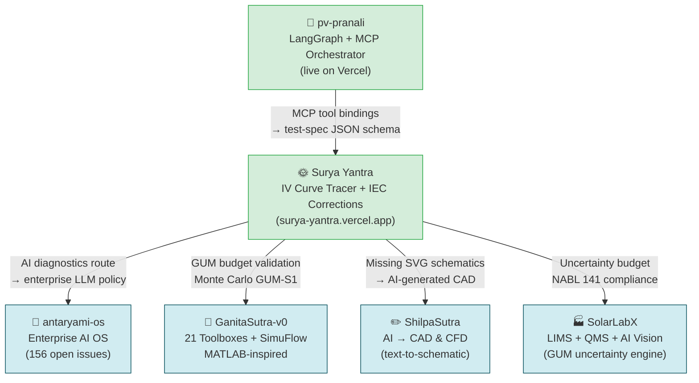
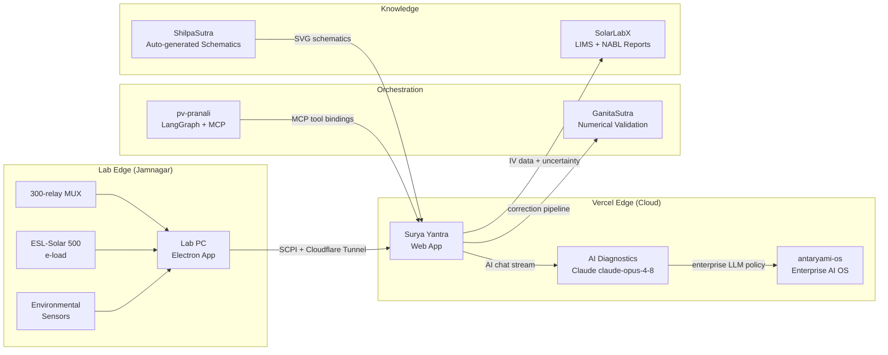

# Surya Yantra Q3 2026 Roadmap: Closing the Open-Source Solar Lab Stack

*Sunday 1 June 2026 — weekly roadmap synthesis*

---

## 1. Where We Are (Phase 1 Completed)

Surya Yantra launched in April 2026 as an open-source, full-stack PV module IV curve tracer
for the Srishti PV Lab 75-module test bed in Jamnagar. In six weeks of editorial sessions
(Mon 27 Apr → Sat 31 May) the platform reached this state:

| Deliverable | Status |
|---|---|
| IEC 60891:2021 Procedures 1–4 (correction engine) | ✅ Shipped |
| SMMF (IEC 60904-7) + IAM Martin-Ruiz (IEC 61853-2) | ✅ Shipped |
| 46-test Vitest suite (all passing) | ✅ Shipped |
| Next.js 14 web app (7 screens) | ✅ Shipped |
| Electron desktop shell (SCPI bridge) | ✅ Shipped |
| Vercel deployment (preview, READY) | ✅ Preview live |
| Vercel production deployment | ❌ Not merged (Issue [#111]) |
| CI/CD GitHub Actions workflow | ❌ Missing (Issue [#118]) |
| `packages/` monorepo (scpi-client, iv-engine, types) | ❌ Missing (Issues [#101], [#110]) |
| `hardware/schematics/` SVG diagrams | ❌ Missing (Issue [#108]) |
| `docs/PRD.md` | ❌ Missing (Issue [#100]) |
| `hardware/WIRING.md` | ❌ Missing (Issue [#99]) |
| `apps/web/.env.example` | ❌ Missing (Issue [#102]) |
| NABL uncertainty budget (GUM/IEC 60891) | ❌ In progress (Issues [#105], [#120]) |
| pv-pranali MCP tool bindings documented | ❌ Missing (Issue [#107]) |

**Open issues as of 2026-06-01:** 92 across all categories.

The Vercel `surya-yantra` project is READY on the preview URL
`surya-yantra-hm15xyeyc-ganeshgowrimitsui-3250s-projects.vercel.app`. A production
deployment requires merging the Saturday SEO branch (`claude/wizardly-lovelace-M8j0q`)
into `main`.

---

## 2. Ecosystem Map

Surya Yantra does not stand alone. Five sibling projects in the same GitHub organisation
each solve a complementary problem. The roadmap below is structured around *integrations*
between them, not just internal Surya Yantra tasks.

*Figure 1. Surya Yantra ecosystem integrations. Green = live, yellow = partial, blue = planned.*

---

## 3. Phase 2 Roadmap — Q3 2026 (July–September)

### 3.1 Foundation: Stabilise the Monorepo and CI

**Priority:** unblocks everything downstream.

The correction engine (`lib/iec60891.ts`, `smmf.ts`, `iam.ts`) lives in `apps/web/lib/`
but must be consumed by the Electron desktop app and, eventually, by pv-pranali's Python
agent via a REST boundary. Extracting it into `packages/iv-engine/` makes it importable
without code duplication.

**Milestones:**

| # | Task | Issues |
|---|---|---|
| 2.1 | Scaffold `packages/iv-engine/` — move IEC libs, update imports | [#101], [#110] |
| 2.2 | Scaffold `packages/scpi-client/` — SCPI command table from ESL-Solar 500 | [#101] |
| 2.3 | Scaffold `packages/types/` — shared interfaces from `apps/web/types/` | [#101] |
| 2.4 | Add `pnpm-workspace.yaml` + Turborepo config | [#101] |
| 2.5 | Wire GitHub Actions CI: typecheck + Vitest on every PR | [#118] |
| 2.6 | Merge main branch + promote Vercel to production | [#111] |
| 2.7 | Create `apps/web/.env.example` for onboarding | [#102] |

### 3.2 Documentation: Fill Structural Gaps

Articles and contributors are blocked by missing reference material.

| # | Task | Issues |
|---|---|---|
| 2.8 | Write `docs/PRD.md` — user stories, acceptance criteria, roadmap phases | [#100] |
| 2.9 | Write `hardware/WIRING.md` — MUX channel map, torque table, grounding | [#99] |
| 2.10 | Generate `hardware/schematics/*.svg` — via ShilpaSutra AI-CAD *(see §4.1)* | [#108] |
| 2.11 | Add `/api/health` and `/api/mux/:bedId/selftest` to `docs/API.md` | [#119] |
| 2.12 | Add References section to `docs/API.md` (RFC 7807, SCPI 1999.0, LXI v1.6) | [#119] |
| 2.13 | Fix API.md generation date footer — replace with git-log pointer | [#103] |

### 3.3 NABL Accreditation Path

The Srishti PV Lab targets NABL ISO 17025 accreditation for PV module IV testing.
This requires a formal measurement uncertainty budget documented in the test report.

**GUM budget (combined uncertainty at k=2, 95%):**

| Uncertainty source | u contribution to u(P_mpp) |
|---|---|
| Pyranometer (Kipp & Zonen SMP10, Class A) | ~0.9 % |
| SMMF numerical integration (trapz, Δλ-limited) | ~0.3–0.8 % |
| Cell temperature (Pt-100 Class A + MAX31865) | ~0.15 % |
| IEC 60891 P2 β-coefficient uncertainty | ~0.18 % |
| **Combined u_c(P_mpp)** | **~0.95–1.1 %** |
| **Expanded U (k=2)** | **~1.1–1.5 %** |

The target is Expanded U < 1.5 % for P_mpp at STC — consistent with IEC 61215 module
qualification and NABL 141 requirements.[^1]

| # | Task | Issues |
|---|---|---|
| 2.14 | Add §6 Measurement Uncertainty to `docs/IEC-CORRECTIONS.md` | [#120] |
| 2.15 | Add `uExpandedPct`, `coverageFactor` to `CorrectionResult` Prisma schema | [#120] |
| 2.16 | Replace `trapz()` with 5-point Gauss-Legendre quadrature in `smmf.ts` | [#105] |
| 2.17 | Validate SMMF Type-B uncertainty contribution vs. SolarLabX GUM engine | [#105] |

### 3.4 pv-pranali MCP Integration

The `pv-pranali` orchestrator is already live on Vercel and uses LangGraph + MCP to
drive multi-agent PV test workflows. The integration with Surya Yantra is blocked because
the MCP tool bindings are undocumented.

| # | Task | Issues |
|---|---|---|
| 2.18 | Create `docs/PV-PRANALI-INTEGRATION.md` with MCP tool list | [#107] |
| 2.19 | Add example pv-pranali → Surya Yantra session payload to `docs/API.md §4` | [#107] |
| 2.20 | Define evaluation rubric for test-spec accuracy (F1 across 4 dimensions) | [#107] |

---

## 4. Article Seeds — Linking Today's Engineering to Research Narratives

Two seeds proposed from the ecosystem map (§2) that no previous session has drafted:

### Seed A — "GanitaSutra Validates Surya Yantra: Monte Carlo GUM-S1 for IEC 60891 Uncertainty"

**Research angle:** GanitaSutra-v0 has 21 numerical toolboxes and a SimuFlow block-diagram
engine. Its Monte Carlo module (GUM Supplement 1, JCGM 101:2008) can be used to
independently validate the analytic GUM budget from §3.3 above.[^4]

**Narrative arc:**
1. Derive the analytic GUM budget for P_mpp through the three-stage pipeline
   (IAM → SMMF → IEC 60891 P2) — already partially done in Issues [#105], [#120]
2. Build an equivalent Monte Carlo SimuFlow block diagram in GanitaSutra-v0:
   each correction block propagates input distributions (Gaussian for G, T;
   trapezoidal for SMMF integration error)
3. Compare: if u_c(P_mpp) from Monte Carlo matches the analytic budget within 5%,
   the pipeline is validated for NABL submission

**Why now:** Issue [#120] already has the analytic budget table. GanitaSutra-v0's
SimuFlow block diagram is the natural visualisation of the three-stage pipeline,
giving both a research output (validated budget) and a diagram for the Fri §2 article slot.

**Target journal:** Solar Energy Materials and Solar Cells (Elsevier) or
Measurement (Elsevier) — both publish IEC correction methodology papers.

**Blocking gaps:**
- GanitaSutra-v0 SimuFlow API not yet integrated with Surya Yantra's REST API
- Lab measurement data needed for Monte Carlo calibration (Issue [#116] analog)

---

### Seed B — "ShilpaSutra Auto-CAD for Open-Source Solar Labs: AI-Generated Hardware Schematics"

**Research angle:** ShilpaSutra is an AI-powered text/multimodal → CAD & CFD platform.
Issue [#108] identifies that `hardware/schematics/` is entirely missing — four SVG diagrams
are needed (system overview, MUX relay matrix, 4-wire Kelvin detail, 19" rack layout).

**Narrative arc:**
1. Use ShilpaSutra's conversational design agent to generate parametric CAD schematics
   from the text descriptions in `docs/HARDWARE-SETUP.md` (§1 ASCII block diagram → SVG)
2. Validate the generated schematics against the BOM (`hardware/BOM.md`) — component
   labels, terminal counts, and cable cross-sections must match
3. Export as SVG and embed directly in the repository (closing Issue [#108])
4. Generalise: propose a ShilpaSutra "hardware docs generator" workflow for any
   open-source instrumentation project

**Why now:** ShilpaSutra's last GitHub activity was March 2026. This use-case demonstrates
a practical research application that can revive engagement with the project. The missing
schematics are also the highest-priority onboarding blocker for Surya Yantra.

**Target publication:** HardwareX (Elsevier) — open-source hardware journal, accepts
instrumentation papers with schematics as primary deliverables.

**Blocking gaps:**
- ShilpaSutra API integration with surya-yantra (no bridge documented)
- Parametric SVG export from ShilpaSutra not confirmed as supported

---

## 5. Phase 3 Vision — Q4 2026 (October–December)

Phase 3 converts Surya Yantra from a single-lab tool into a networked cloud lab platform:

*Figure 2. Surya Yantra Phase 3 architecture: from single lab to cloud-connected platform.*

**Phase 3 milestones (indicative):**

| Milestone | Target | Dependency |
|---|---|---|
| antaryami-os AI policy layer for `/api/ai/chat` | Oct 2026 | Phase 2 CI green |
| SolarLabX NABL report generation (PDF) | Oct 2026 | NABL budget §3.3 |
| Remote multi-lab support (second test bed) | Nov 2026 | pv-pranali MCP §3.4 |
| GanitaSutra SimuFlow live validation dashboard | Nov 2026 | Seed A article |
| ShilpaSutra schematic auto-generation pipeline | Dec 2026 | Seed B article |
| Phase 3 production release | Dec 2026 | All Phase 2 issues closed |

---

## 6. Structural Lint Summary (2026-06-01)

Linting `docs/` on the `main` branch (as of 2026-06-01, last commit 2026-04-17):

| File | Issue | Severity | Filed |
|---|---|---|---|
| `README.md` | References `hardware/schematics/`, `packages/`, `hardware/WIRING.md`, `docs/PRD.md` — all missing | High | [#117], [#99], [#100], [#108] |
| `docs/HARDWARE-SETUP.md §4.2` | References `hardware/firmware/mux-controller/` (not in repo) | Medium | [#117] |
| `docs/API.md` | Missing `/api/health` and `/api/mux/:bedId/selftest`; no References section | Medium | [#119] |
| `docs/API.md` | Footer date static at 2026-04-17 | Low | [#103] |
| `docs/API.md` | (Fixed Sat): model ref `claude-opus-4-7` → `claude-opus-4-8` | Fixed | Sat PR |
| All `docs/` | (Fixed Sat): YAML front matter added for SEO | Fixed | Sat PR |

No figures exist in `docs/` (all diagrams are ASCII art or Mermaid), so no alt-text
issues. Heading hierarchy is correct throughout. No broken external links found in
manual spot-check.

**Outstanding: 92 open issues** — the 15 most recent (Issues [#98]–[#120]) cover
structural, content, and deployment gaps in priority order.

---

## 7. Roadmap Risk Register

| Risk | Likelihood | Impact | Mitigation |
|---|---|---|---|
| NABL accreditation delayed if u_c > 1.5 % | Medium | High | Gauss-Legendre quadrature (Issue [#105]) + SolarLabX cross-validation |
| pv-pranali MCP bindings remain undocumented | Medium | High | Assign Issue [#107] to a dedicated sprint; block Phase 3 on it |
| Vercel production never promoted (stays preview) | Low | Medium | Merge Sat SEO branch → main; smoke-test per DEPLOYMENT.md §7 |
| ShilpaSutra SVG export quality insufficient for schematics | Medium | Medium | Fallback: draw SVGs manually in KiCad; use ShilpaSutra for validation only |
| GanitaSutra-v0 Monte Carlo API not yet REST-accessible | High | Low (for Phase 2) | Seed A article uses SimuFlow as a conceptual model; real integration is Phase 3 |

---

## 8. Next Actions (Week of 2 June 2026)

- **Mon 2 Jun:** Outline `docs/PRD.md` (Issue [#100]) — user stories, acceptance criteria
- **Tue 3 Jun:** Stale-draft audit — mark any draft older than 30 days without a blocking issue as `status: stale`
- **Wed 4 Jun:** Add §6 Measurement Uncertainty to `docs/IEC-CORRECTIONS.md` (Issue [#120])
- **Thu 5 Jun:** Peer-review checklist on `posts/2026-05-30-iv-reliability-loop.md` (from Fri session)
- **Fri 6 Jun:** Polish Seed A article (§4) with ideation→implementation diagram
- **Sat 7 Jun:** SEO pass — canonical URLs and og_image for all remaining drafts
- **Sun 8 Jun:** Phase 2 milestone review — are 5 of 20 Phase 2 tasks closed?

---

## References

[^1]: JCGM 100:2008, *Evaluation of measurement data — Guide to the expression of uncertainty in measurement (GUM)*. Bureau International des Poids et Mesures.

[^2]: IEC 60891:2021, *Photovoltaic devices — Procedures for temperature and irradiance corrections to measured I-V characteristics*. IEC.

[^3]: NABL 141, *Guidelines for Estimation of Uncertainty of Measurements in Testing and Calibration*. National Accreditation Board for Testing and Calibration Laboratories, India.

[^4]: JCGM 101:2008, *Evaluation of measurement data — Supplement 1 to the GUM — Propagation of distributions using a Monte Carlo method*. Bureau International des Poids et Mesures.

[^5]: Martin N., Ruiz J.M., *Calculation of the PV modules angular losses under field conditions by means of an analytical model*, Solar Energy Materials and Solar Cells 70 (2001) 25–38.
