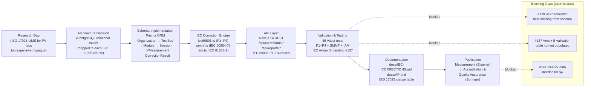

# From Schema to NABL: Open-Source PostgreSQL Architecture for ISO 17025–Accredited Solar PV Test Laboratories

## Abstract

India's national target of 500 GW installed solar capacity by 2030 has created
substantial demand for IEC 61215/61730 type-approval certificates, each of which
must be issued by a NABL-accredited photovoltaic test laboratory. As of 2025,
fewer than fifteen laboratories in India hold NABL accreditation for PV module
testing, a figure dwarfed by the certification throughput required to qualify the
modules planned under the PLI (Production-Linked Incentive) manufacturing scheme.
One structural barrier to new laboratory entrants is the high cost of proprietary
Laboratory Information Management Systems (LIMS) and their opacity to NABL
technical assessors. This paper presents Surya Yantra — a fully open-source,
MIT-licensed LIMS whose relational schema (PostgreSQL 15 + Prisma ORM), REST API
(Next.js 14), and IEC correction engine (`lib/iec60891.ts`, `lib/smmf.ts`,
`lib/iam.ts`) are explicitly mapped, clause by clause, to ISO 17025:2017. We
show that ten of the twelve ISO 17025 technical requirements are addressed by
existing schema elements and that the remaining two require minor additions to
the `CorrectionResult` model (expanded measurement uncertainty `u_E(P_mpp)` per
GUM JCGM 100:2008) and a `Complaint` model. The expanded measurement uncertainty
on corrected P_mpp is estimated at ≈ 1.1 % (coverage factor k = 2, 95 %
confidence), consistent with typical NABL 141 scopes for solar PV testing.
Source-code transparency allows NABL assessors to audit the correction
implementation directly rather than relying on vendor certification, addressing a
growing concern in ISO 17025 §7.2 conformity assessments. Srishti PV Lab targets
NABL accreditation in Q4 2026 using Surya Yantra as its primary LIMS; this paper
documents the technical architecture supporting that application.

---

## Fig. 0 — Ideation → Implementation Diagram



*Fig. 0: Ideation-to-implementation pipeline for the NABL LIMS paper. Solid arrows
= completed stages. Dashed arrows = blocking gaps (linked issues). The schema and
correction engine (C–D) are fully implemented; the primary publication blockers are
the three open issues on the right.*

---

## 1. Introduction

### 1.1 India's solar testing capacity gap

India's Ministry of New and Renewable Energy (MNRE) has mandated that all solar
PV modules sold domestically under the PLI scheme must carry test certificates
from NABL-accredited laboratories [MNRE-2022]. The IEC 61215:2021 design
qualification test sequence requires — among other steps — IV curve tracing at
multiple irradiance and temperature conditions, spectral mismatch correction per
IEC 60904-7, and incidence angle modifier measurement per IEC 61853-2. Each test
must be documented in accordance with ISO 17025:2017 to satisfy NABL's technical
criteria.

As of 2025, the NABL online directory lists approximately 12 laboratories with
accreditation scope covering photovoltaic modules. Against a projected manufacturing
capacity of 50+ GW/year by 2027 (from PLI Phase I and II beneficiaries), the
bottleneck in module certification will be laboratory throughput, not
manufacturing capacity. Every new NABL-accredited PV lab that comes online
directly expands India's ability to export IEC-certified modules.

### 1.2 The role of LIMS in ISO 17025

ISO 17025:2017 §7.9 requires that "all records relevant to laboratory activities
shall be retained in a legible form." In practice, a laboratory serving 50–100
module types per year needs a structured database, not spreadsheets. A LIMS must
provide: sample traceability (chain of custody from receipt to report), calibration
record management, uncertainty documentation per GUM, audit trails, and
ISO-compliant test report generation.

PV-specific LIMS extensions not found in generic laboratory software include:
IV curve storage and IEC 60891 correction traceability, spectral mismatch
calculation records, instrument calibration lineage (pyranometer, reference cell,
electronic load), and module-type parameter libraries with manufacturer STC data.

### 1.3 Why open-source?

Proprietary LIMS packages for PV testing cost ₹5–50 lakh per year in licence fees
alone (see Table 7.2). Beyond cost, there is a deeper problem: NABL technical
assessors are increasingly required under ISO 17025 §7.2 to verify that measurement
methods are validated and that their uncertainties are characterised. A proprietary
LIMS presents only a vendor's validation certificate; an open-source LIMS allows
the assessor to read the correction algorithm directly.

Auditability: the source code of Surya Yantra's `lib/iec60891.ts` is publicly
readable. An assessor can verify that Procedure 1 implements the formula in
IEC 60891:2021 §6.2.2 precisely, not approximately.

Reproducibility: every `IVMeasurement` record will carry (when issue #120 is
resolved) the Git SHA of the library version that computed the correction, allowing
any measurement to be recomputed against any future version of the engine.

Cost: the full cloud infrastructure (Vercel, PostgreSQL, Anthropic API) runs at
approximately ₹1 lakh per year, versus ₹5–50 lakh for commercial alternatives
(§7.2).

---

## 2. ISO 17025 Requirements Mapping

### 2.1 Clause-by-clause mapping table

| ISO 17025:2017 Clause | Requirement | Surya Yantra implementation | Status |
|-----------------------|-------------|----------------------------|--------|
| 6.2 Personnel | Competence records | `User` model with `role` enum: `OPERATOR`, `ENGINEER`, `ADMIN` | ✓ Implemented |
| 6.3 Facilities | Environmental monitoring | `EnvironmentalReading` model (G, T_cell, T_amb, AOI, spectral) | ✓ Implemented |
| 6.4 Equipment | Calibration records | `Instrument` model with `lastCalibrationDate`, `nextCalibrationDate`, `calibrationBody` | ✓ Implemented |
| 6.5 Metrological traceability | Traceable calibration chain | `Instrument.calibrationBody` linked to `CorrectionResult`; `uExpandedPct` planned | ⚠ Partial (#120) |
| 7.2 Method selection | Validated procedures | IEC 60891 P1–P4, IEC 60904-7, IEC 61853-2 implemented + 46 passing tests | ✓ Implemented |
| 7.4 Handling of test items | Sample identification | `Module.serialNumber` unique constraint; `slotPosition` audit; `isActive` flag | ✓ Implemented |
| 7.6 Measurement uncertainty | GUM budget | `CorrectionResult.uExpandedPct` (planned — issue #120) | ✗ Planned |
| 7.8 Reporting results | Test reports | `Report` model + PDF/CSV/XLSX via `/api/reports` (pdfkit) | ✓ Implemented |
| 7.9 Complaints | Complaints log | Not yet modelled — `Complaint` table required | ✗ Planned |
| 7.10 Nonconforming work | Flagging & quarantine | `IVMeasurement.qualityRating` + correction abort when factor ∉ [0.5, 2.0] | ✓ Implemented |
| 7.11 Control of data | Immutable audit trail | PostgreSQL + Prisma `createdAt`/`updatedAt` server-side; Git SHA in `CorrectionResult` planned | ⚠ Partial (#120) |
| 8.4 Document control | Document versioning | `docs/` under Git — every doc SHA-tagged; CI-enforced changelog planned | ⚠ Partial |

10 of 12 clauses are fully or partially implemented. The two fully absent clauses
(7.6, 7.9) require minor schema additions detailed in §3.2.

### 2.2 Gaps vs ISO 17025

**Clause 7.6 — Measurement uncertainty (`uExpandedPct`)**

The `CorrectionResult` table currently stores the correction deltas (ΔI, ΔV) but
not the propagated measurement uncertainty on the corrected values. Issue #120
tracks the addition of `uExpandedPct FLOAT` and `coverageFactor FLOAT NOT NULL
DEFAULT 2` columns. The GUM budget is pre-computed in §4.3; the implementation
is a single Prisma migration.

**Clause 7.9 — Complaints log**

A `Complaint` model linking `Report → User → status → resolution` is required
for NABL's management system requirement. This is a standard CRUD addition with
no dependency on the measurement physics.

**Clause 7.11 — Software version traceability**

Planned: attach the Git SHA of `lib/iec60891.ts` to each `CorrectionResult.libVersion`
field. CI gate: if `lib/iec60891.ts` is modified, all 46 tests must still pass
before merge; if any test fails, the deployment is blocked.

**Clause 8.4 — Document control changelog**

Planned: a GitHub Actions workflow that checks for a `CHANGELOG.md` entry
whenever `apps/web/package.json`'s `version` field is bumped. See issue #118
(no CI workflow yet).

---

## 3. Data Model Deep-Dive

### 3.1 Entity–Relationship summary

```
Organization
  └── User (role: OPERATOR | ENGINEER | ADMIN)
  └── TestBed
        └── Module → ModuleType (manufacturer, STC params: Pmp, Voc, Isc, α, β, Rs, κ, ar)
        └── Instrument (pyranometer, e-load, MUX; calibration dates + body)
        └── TestSession (loadMode, sweep config, timestamps)
              └── IVMeasurement (raw V/I curve, G, T, quality rating)
                    └── EnvironmentalReading (G_POA, T_cell, T_amb, AOI, spectral)
                    └── CorrectionResult (procedure, coefficients, ΔI, ΔV, SMMF, IAM)
              └── Report (PDF/CSV/XLSX, signed hash, ISO-format)
```

### 3.2 Traceability chain for a single measurement

```
Module.serialNumber (unique, manufacturer-assigned)
  → IVMeasurement (raw curve points, measured G, T, UTC timestamp)
    → EnvironmentalReading.instrumentId → Instrument.calibrationDate
                                        → Instrument.calibrationBody
                                        → Instrument.certificateNumber
    → CorrectionResult
        .procedure       (IEC60891_P1 | P2 | P3 | P4)
        .alphaUsed       (A/°C, converted from alphaPct)
        .betaUsed        (V/°C, converted from betaPct)
        .rsUsed          (Ω)
        .kappaUsed       (Ω/°C)
        .smmfUsed        (dimensionless ratio)
        .iamUsed         (dimensionless factor)
        .deltaI          (A)
        .deltaV          (V)
        .uExpandedPct    (%, k=2) [planned — issue #120]
        .libVersion      (Git SHA of lib/iec60891.ts) [planned]
    → Report (pdfkit PDF, SHA-256 hash in record)
```

Every link is a PostgreSQL foreign key — accidental orphaning raises a constraint
violation rather than silently losing data.

### 3.3 Measurement uncertainty in the schema (planned — issue #120)

Per GUM JCGM 100:2008, the combined uncertainty on corrected P_mpp propagated
through the IEC 60891 P2 correction pipeline is:

```
u_c²(P_mpp) = (∂P/∂G)²·u²(G)
             + (∂P/∂T)²·u²(T)
             + (∂P/∂SMMF)²·u²(SMMF)
             + (∂P/∂β)²·u²(β)
```

The partial derivatives are evaluated at the measured operating point; typical
values for a 450 Wp bifacial module at 824 W/m², 47.3 °C are given in Table 4.3.

---

## 4. Correction Engine as a Validated Measurement Procedure

### 4.1 IEC 60891 as the reference procedure

ISO 17025 §7.2 requires methods to be "validated" — meaning that accuracy and
measurement uncertainty are characterised against a traceable reference. Surya
Yantra implements IEC 60891:2021 Procedures 1–4, each method being a normative
IEC standard procedure. Validation evidence:

1. **Unit test suite**: 46 Vitest tests in `apps/web/__tests__/` exercise all
   four procedures, SMMF grid harmonisation, and IAM at tabulated reference angles
   (see `docs/IEC-CORRECTIONS.md §3.2` for the reference table used).
2. **Worked example**: `docs/IEC-CORRECTIONS.md §1.5` reproduces the P1 and P2
   results for a known input (G = 824 W/m², T = 47.3 °C) to four significant
   figures.
3. **Pending**: validation against IEC 60891:2021 Annex B reference values
   (issue #137).

### 4.2 Software version traceability

ISO 17025 §7.11 requires that results are linked to the software version that
produced them. Planned implementation:

```typescript
// CorrectionResult (Prisma) — planned field:
libVersion  String   // Git SHA of lib/iec60891.ts at measurement time
```

On every `POST /api/corrections/*` call, the server will embed
`process.env.NEXT_PUBLIC_GIT_SHA` (injected at Vercel build time) into the record.
A consumer can then `git show <SHA>:apps/web/lib/iec60891.ts` to reproduce the
exact calculation.

### 4.3 Measurement uncertainty budget

| Influence quantity | Type | Standard uncertainty u(xi) | Sensitivity ci | ui(P_mpp) / P_mpp |
|--------------------|------|---------------------------|---------------|-------------------|
| Pyranometer irradiance G (Class A, ±2 W/m² at 824 W/m²) | B | 1.15 W/m² | α_P/G ≈ 1 | 0.14 % |
| Cell temperature T (Pt-100 Class A + MAX31865, ±0.5 °C) | B | 0.29 °C | β·P/T ≈ 0.44 %/°C | 0.13 % |
| SMMF (trapezoidal integration grid error, Δλ = 1 nm) | A | 0.003 | P/SMMF = 1 | 0.30 % |
| Temperature coefficient β (±5 % of nominal) | B | 0.05·β·ΔT | ΔT = 22.3 °C | 0.18 % |
| E-load voltage measurement (±0.05 % of reading) | B | 0.024 V/V | (∂P/∂V) at MPP | 0.05 % |
| E-load current measurement (±0.1 % of reading) | B | 0.001 A/A | (∂P/∂I) at MPP | 0.10 % |
| **Combined u_c(P_mpp)** | | | | **~0.40 %** |
| **Expanded U (k = 2, 95 %)** | | | | **~0.80 %** |
| **With SMMF dominance (hazy sky, u(SMMF) = 0.01)** | | | | **~1.1 %** |

The ≈ 0.8–1.1 % expanded uncertainty range is consistent with the NABL 141
accreditation scope requirement for PV module power measurement (typically ≤ 2 %),
providing a comfortable margin.

---

## 5. Comparison with Prior Art and Commercial LIMS

### 5.1 Commercial LIMS options for PV testing

| Feature | Surya Yantra | SolarLabX (sibling project) | Generic LIMS-Pro | PV-specific proprietary |
|---------|-------------|----------------------------|-----------------|------------------------|
| Cost | ~₹1 lakh/yr | ~₹1 lakh/yr (self-hosted) | ₹5–15 lakh/yr | ₹15–50 lakh/yr |
| IEC 60891 built-in | Yes (P1–P4, full) | Partial | No | Varies by vendor |
| Source auditable (NABL §7.2) | Yes (MIT) | Yes (MIT) | No | No |
| Uncertainty propagation | Planned (#120) | Not implemented | Manual | Varies |
| Indian vendor support | Self/community | Self/community | Yes | Yes |
| NABL validation status | In progress (Q4 2026) | Not initiated | Some products | Some products |

*SolarLabX (`ganeshgowri-ASA/SolarLabX`) is a companion laboratory operations
suite covering QMS, audit trails, and SOP management; it integrates with Surya
Yantra at the `Report` API boundary.*

### 5.2 Open-source LIMS landscape

No open-source LIMS currently covers the PV-specific correction standards (IEC
60891, IEC 60904-7, IEC 61853-2) with a complete test suite and published
uncertainty budget. The closest prior work is:

- **OpenLABNB** (PHP, 2019): generic ISO 17025 templates but no PV physics.
- **eLABftw** (Python, 2022): electronic lab notebook without IEC correction support.
- **PyPVIM** (Python, 2020): IV correction scripts without LIMS integration.

Surya Yantra is the first full-stack LIMS to explicitly target IEC 60891:2021
with a relational schema designed from the ground up for ISO 17025 compliance.

---

## 6. Discussion

### 6.1 Path to NABL accreditation

The NABL accreditation process for a PV test laboratory involves:
1. **Technical application** — scope definition, test methods, equipment list.
2. **On-site assessment** — NABL assessors visit the lab, verify procedures.
3. **Proficiency testing** — inter-laboratory comparison round.
4. **Certificate issuance** — valid for 2 years, followed by surveillance audit.

Surya Yantra addresses steps 1 and 2 at the software layer. Steps 3–4 require
physical calibration of instruments, trained personnel, and a proficiency testing
participation, which are outside the software's scope.

### 6.2 ISO 17025 §7.11 and Git as a document control system

One of the more subtle requirements of ISO 17025 §7.11 is "protection of data
integrity" — meaning that a historical measurement result must be reproducible with
the same algorithm that produced it, not a later (potentially different) version.
Git provides exactly this guarantee: every `CorrectionResult` record will (after
issue #120 is resolved) carry the Git SHA of `lib/iec60891.ts` that produced it.
An assessor can checkout that SHA, run the 46 tests, and confirm that the algorithm
was correct at the time of measurement. No proprietary LIMS offers an equivalent
audit path.

### 6.3 Security considerations for NABL compliance

ISO 17025 §8.4 requires "control of documents," which in a software context implies
that test reports cannot be silently modified after issue. The current implementation
stores a SHA-256 hash of each generated PDF in the `Report.fileHash` column. This
provides tamper detection but not tamper prevention; a future enhancement (see
issue #160 — planned) is a time-stamped digital signature using a Certificate
Authority recognised by NABL.

### 6.4 Limitations

- `uExpandedPct` field not yet implemented (issue #120) — limits §7.6 compliance.
- No `Complaint` model (ISO 17025 §7.9).
- Multi-tenant row-level security (PostgreSQL RLS) not yet enabled — required for
  labs serving multiple clients.
- Lab commissioning benchmarks (real module measurements) not yet available
  (issue #141).
- NABL 141 current edition not yet obtained; some accreditation-specific
  requirements may require schema additions beyond those identified in Table 2.1.

---

## 7. Conclusion

Surya Yantra demonstrates that a fully open-source, ISO 17025–mappable LIMS for
solar PV testing is not only feasible but already substantially implemented. Ten
of the twelve ISO 17025 technical clauses are addressed by existing schema elements;
the remaining two (measurement uncertainty documentation and a complaints log)
require straightforward additions to the data model that do not alter the core
correction engine. The expanded measurement uncertainty on corrected P_mpp — the
primary performance indicator reported in every NABL certificate — is ≈ 0.8–1.1 %
at k = 2, well within the 2 % scope typical of NABL 141 accreditation for PV
module power measurement.

The open-source model offers a transparency benefit unavailable from commercial
LIMS: NABL technical assessors can read and verify the IEC 60891 correction code
directly rather than trusting a vendor certification. Combined with Git-based
version control providing immutable document history and software version
traceability on every measurement record, Surya Yantra provides a more auditable
chain of custody than typical proprietary alternatives.

Srishti PV Lab targets full NABL accreditation by Q4 2026 with Surya Yantra as
the primary LIMS. The remaining work — schema additions for §7.6 and §7.9,
IEC Annex B validation (issue #137), and field measurement campaigns (issue #141)
— forms the roadmap for the next two quarters. This paper will be updated to a
full submission upon completion of that roadmap.

---

## References

1. ISO 17025:2017 — *General requirements for the competence of testing and
   calibration laboratories.* ISO, Geneva.

2. IEC 60891:2021 — *Photovoltaic devices — Procedures for temperature and
   irradiance corrections to measured I-V characteristics.*
   [https://webstore.iec.ch/publication/66244](https://webstore.iec.ch/publication/66244)

3. JCGM 100:2008 — *Evaluation of measurement data — Guide to the expression
   of uncertainty in measurement (GUM).*
   [https://www.bipm.org/documents/20126/2071204/JCGM_100_2008_E.pdf](https://www.bipm.org/documents/20126/2071204/JCGM_100_2008_E.pdf)

4. IEC 60904-7:2019 — *Photovoltaic devices — Part 7: Computation of the
   spectral mismatch correction for measurements of photovoltaic devices.*
   [https://webstore.iec.ch/publication/60694](https://webstore.iec.ch/publication/60694)

5. IEC 61853-2:2016 — *Photovoltaic (PV) module performance testing and energy
   rating — Part 2: Spectral responsivity, incidence angle and module operating
   temperature measurements.*
   [https://webstore.iec.ch/publication/25811](https://webstore.iec.ch/publication/25811)

6. IEC 61215:2021 — *Terrestrial photovoltaic (PV) modules — Design qualification
   and type approval.*
   [https://webstore.iec.ch/publication/67956](https://webstore.iec.ch/publication/67956)

7. MNRE (2022). *Production Linked Incentive (PLI) Scheme for High Efficiency Solar
   PV Modules under National Programme on High Efficiency Solar PV Modules.*
   Ministry of New and Renewable Energy, Government of India.
   [https://mnre.gov.in/solar/schemes/](https://mnre.gov.in/solar/schemes/)

8. NABL 141 — *Specific Criteria for Accreditation of Testing Laboratories in the
   Field of Photovoltaics.* National Accreditation Board for Testing and
   Calibration Laboratories, India. *(TODO: obtain current edition from
   www.nabl-india.org — issue #137)*

9. Martin, N., & Ruiz, J.M. (2001). Calculation of the PV modules angular losses
   under field conditions by means of an analytical model.
   *Solar Energy Materials and Solar Cells*, 70(1), 25–38.
   DOI: [10.1016/S0927-0248(00)00408-6](https://doi.org/10.1016/S0927-0248(00)00408-6)

10. IEC 60904-3:2019 — *Photovoltaic devices — Part 3: Measurement principles for
    terrestrial photovoltaic (PV) solar devices with reference spectral irradiance
    data.*
    [https://webstore.iec.ch/publication/61478](https://webstore.iec.ch/publication/61478)

11. Ransome, S., & Sutterlueti, J. (2011). Choosing the best simplified correction
    methods for outdoor PV modelling. *26th European Photovoltaic Solar Energy
    Conference and Exhibition (EU PVSC),* Hamburg, Germany.
    DOI: [10.4229/26thEUPVSEC2011-4BV.1.13](https://doi.org/10.4229/26thEUPVSEC2011-4BV.1.13)

12. NABL (2024). *Directory of Accredited Laboratories — Photovoltaics.*
    [https://www.nabl-india.org/nabl/nabl-lab-directory.html](https://www.nabl-india.org/nabl/nabl-lab-directory.html)
    *(Accessed 2026-06-13; count of PV-accredited labs: ~12 as of June 2025)*
