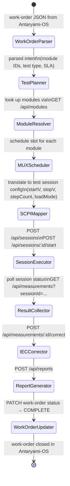
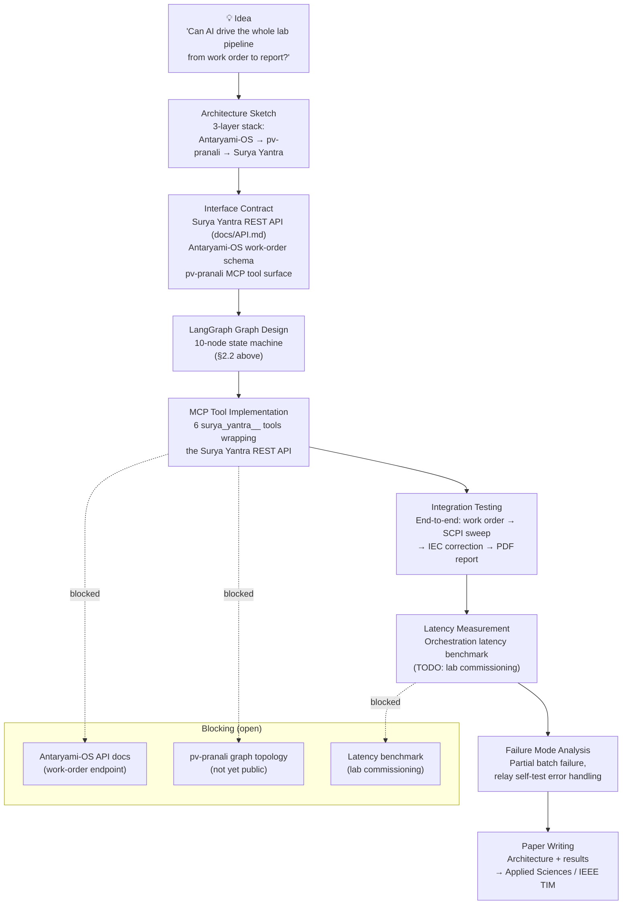

# Seed Outline

## 1. Abstract (≈ 200 words — to be written)

**Thesis:** The gap between organizational work-order creation (Antaryami-OS)
and physical instrument execution (Surya Yantra SCPI sweep) can be closed by
a LangGraph multi-agent graph (pv-pranali) that translates natural-language
test requests into structured API calls, with each node in the graph corresponding
to one layer of the instrument control stack.

**Key claim:** An AI-native lab automation stack — where organizational context
(who ordered the test, what SLA applies, which module batch is under test) is
preserved from work-order creation to PDF report — enables traceability levels
not achievable with traditional point-to-point integrations.

---

## 2. System Architecture

### 2.1 Three-layer stack

```
┌─────────────────────────────────────────────────────────────────────┐
│  LAYER 1 — Organizational (Antaryami-OS)                            │
│  Work orders · schedules · personnel assignment · SLA tracking      │
│  Last commit: 2026-05-10                                            │
│  Interface: REST API (antaryami-os/app/api/work-orders/)            │
└────────────────────────────┬────────────────────────────────────────┘
                             │ work-order JSON + module batch context
                             ▼
┌─────────────────────────────────────────────────────────────────────┐
│  LAYER 2 — Orchestration (pv-pranali / LangGraph + MCP)             │
│  Multi-agent graph translating intent → structured API calls        │
│  Nodes: WorkOrderParser → TestPlanner → SCPIMapper → ResultAggregator│
│  Last commit: 2026-05-03                                            │
│  Interface: MCP tools over Claude Code / MiMo on WSL/tmux           │
└────────────────────────────┬────────────────────────────────────────┘
                             │ POST /api/sessions (Surya Yantra)
                             ▼
┌─────────────────────────────────────────────────────────────────────┐
│  LAYER 3 — Instrument (Surya Yantra)                                │
│  Test session mgmt · MUX switching · SCPI sweep · IEC correction    │
│  Interface: REST API (docs/API.md) + WebSocket streaming            │
└─────────────────────────────────────────────────────────────────────┘
```

### 2.2 LangGraph node topology (proposed)



### 2.3 MCP tool surface

Each LangGraph node invokes one or more MCP tools:

| Node | MCP tool | Surya Yantra endpoint |
|------|----------|----------------------|
| ModuleResolver | `surya_yantra__get_modules` | `GET /api/modules?technology=...` |
| MUXScheduler | `surya_yantra__mux_status` | `GET /api/mux/:bedId` |
| SessionExecutor | `surya_yantra__create_session` | `POST /api/sessions` |
| SessionExecutor | `surya_yantra__start_session` | `POST /api/sessions/:id/start` |
| IECCorrector | `surya_yantra__correct_measurement` | `POST /api/measurements/:id/correct` |
| ReportGenerator | `surya_yantra__create_report` | `POST /api/reports` |

---

## 3. Research Questions

1. **Orchestration fidelity**: Does the LangGraph orchestrator correctly translate
   a natural-language work order ("test all 5 HJT modules in Row 3 to STC using
   P2 correction") into the correct sequence of REST calls, including selecting
   the right MUX slots and IEC procedure?

2. **Latency**: What is the end-to-end latency from work-order creation in
   Antaryami-OS to SCPI sweep start in Surya Yantra? Is it acceptable for a
   same-day turnaround SLA?

3. **Error handling**: How does the LangGraph graph handle partial failures
   (e.g., a relay self-test failure at slot 34 mid-batch)?

4. **Traceability**: Is the organizational context (work-order ID, operator ID,
   SLA tier) preserved in the `IVMeasurement` and `Report` records for NABL
   audit purposes?

---

## 4. Connection to Sibling Repos

### 4.1 Antaryami-OS (last updated 2026-05-10)

The May 10 commits to `antaryami-os` added enterprise workflow automation
features to the organizational AI OS. The proposed integration uses Antaryami-OS
as the **source of test intent** — work orders arrive as structured JSON and
carry organizational metadata (client ID, SLA, urgency) that is threaded through
the entire orchestration layer into the final NABL test report.

### 4.2 pv-pranali (last updated 2026-05-03)

`pv-pranali` already implements a LangGraph + MCP orchestration pipeline for
"PV Test Equipment Proposal" — generating procurement specifications for test
equipment by orchestrating ShilpaSutra (parametric CAD), Antaryami-OS
(organizational approval workflows), and other agents. The proposed paper extends
this graph by adding a **test execution** branch: instead of stopping at the
procurement proposal, the graph continues into Surya Yantra's REST API to execute
the test and retrieve the results.

### 4.3 SolarLabX (last updated 2026-03-25)

`SolarLabX` provides the LIMS + QMS + audit trail layer that wraps around Surya
Yantra. The integration architecture positions SolarLabX as the **management
layer** (personnel competence, calibration schedules, SOPs), Antaryami-OS as the
**work-order layer**, pv-pranali as the **orchestration layer**, and Surya Yantra
as the **instrument layer**. Together, the four repos form a complete,
AI-driven PV laboratory automation stack.

---

## 5. Ideation → Implementation Diagram



---

## 6. Proposed Experiments

1. **Correctness test**: Feed 10 natural-language work orders of increasing
   complexity to the LangGraph graph; measure how many produce the correct
   sequence of REST calls (ground truth: manually authored call sequences).

2. **Latency test**: Measure wall-clock time from work-order JSON submission
   to first SCPI `MEAS:MPPSCAN:EXEC` command on the wire (target: < 30 s).

3. **Failure injection**: Deliberately fail the `POST /api/mux/:bedId/connect`
   call at step 3 of 10; verify that the graph routes to the error-handling
   subgraph and marks the work-order as `PARTIAL_FAILURE` in Antaryami-OS.

4. **Traceability audit**: Verify that the final `Report` PDF carries the
   Antaryami-OS work-order ID and operator ID in its metadata section.

---

## 7. References (seed — to be expanded)

1. LangGraph documentation. *LangGraph: A library for building stateful,
   multi-actor applications with LLMs.*
   [https://langchain-ai.github.io/langgraph/](https://langchain-ai.github.io/langgraph/)

2. Anthropic (2024). *Model Context Protocol — Open standard for LLM tool
   access.* [https://modelcontextprotocol.io](https://modelcontextprotocol.io)

3. IEC 60891:2021 — Photovoltaic devices — Procedures for temperature and
   irradiance corrections to measured I-V characteristics.
   [https://webstore.iec.ch/publication/66244](https://webstore.iec.ch/publication/66244)

4. ISO 17025:2017 — General requirements for the competence of testing and
   calibration laboratories. ISO, Geneva.

5. *(TODO: prior work on AI-driven laboratory automation)*

6. *(TODO: pv-pranali paper or citation if published)*
