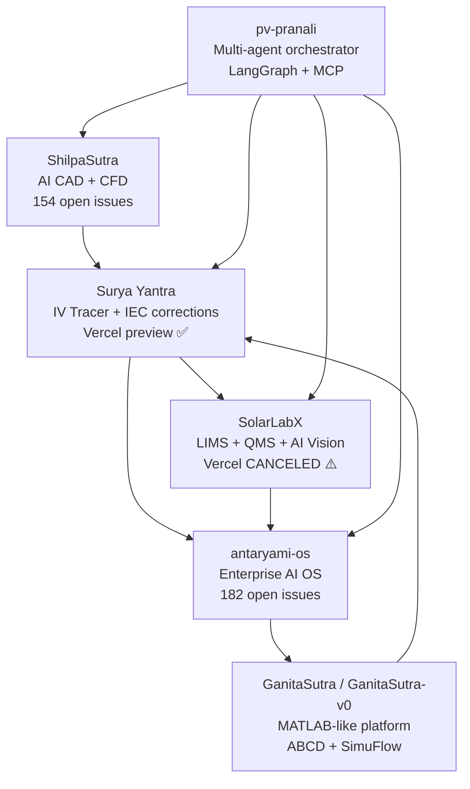

# Srishti PV Lab Software Ecosystem — Q3 2026 Roadmap

> **Sunday roadmap article — 2026-06-14 (W24)**
> Status: OUTLINE — sections marked TODO need lab data or integration work

---

## 1. Abstract

*(≤ 250 words — TODO: write after sections filled)*

The Srishti PV Lab (Jamnagar, India) has been building an open-source
software stack for photovoltaic module testing since January 2026. By
mid-June 2026 the ecosystem comprises six active repositories spanning
IV curve tracing (Surya Yantra), laboratory information management
(SolarLabX), enterprise AI orchestration (antaryami-os), mathematical
computation (GanitaSutra/GanitaSutra-v0), AI-powered CAD/CFD (ShilpaSutra),
and multi-agent proposal orchestration (pv-pranali). This article presents
a structured status review as of W24 2026 and a prioritised Q3 roadmap
targeting IEC 60891:2021 field validation, NABL ISO 17025 accreditation
readiness, and production Vercel deployment of the web platforms.

---

## 2. Ecosystem Map

**Last push dates (all on 2026-06-13):**
- antaryami-os, GanitaSutra-v0, ShilpaSutra, SolarLabX — all active

---

## 3. Phase 1 Completion Review (as of 2026-06-14)

### 3.1 Surya Yantra

| Milestone | Status | Notes |
|-----------|--------|-------|
| Next.js 14 web app scaffold | ✅ Done | `apps/web/` |
| Electron desktop app | ✅ Done | `apps/desktop/` |
| IEC 60891:2021 P1–P4 engine | ✅ Done | `apps/web/lib/iec60891.ts` |
| SMMF (IEC 60904-7) | ✅ Done | `apps/web/lib/smmf.ts` |
| IAM Martin-Ruiz (IEC 61853-2) | ✅ Done | `apps/web/lib/iam.ts` |
| PostgreSQL schema (Prisma) | ✅ Done | 20 models |
| WebSocket IV streaming | ✅ Done | `apps/web/app/api/ws/` |
| shadcn/ui component library | ✅ Done | 10 components |
| Vitest test suite | ✅ Done | IEC engine + smmf + iam |
| Production Vercel deployment | ❌ Missing | Preview only — no `main` → production link |
| `packages/` monorepo packages | ❌ Missing | scpi-client, iv-engine, types referenced but absent |
| Hardware schematics | ❌ Missing | `hardware/schematics/` absent |
| Hardware WIRING.md | ❌ Missing | Referenced in README |
| `docs/PRD.md` | ❌ Missing | Referenced in README |
| ESL-Solar 500 live SCPI driver | ❓ Unknown | Not in repo yet |
| MUX relay firmware | ❓ Unknown | `hardware/firmware/` absent |

### 3.2 SolarLabX

Active development, 104 open issues. Recent engineering highlights:
- Auth hardening on all 13 API routes
- GUM Monte Carlo (JCGM 101:2008) UI
- 91 + 64 Vitest unit tests across solver modules
- HTTP security headers + jsPDF CVSS-8.1 patch
- TypeScript @ts-nocheck elimination (22 shadcn/ui components, PR #185)
- Prompt caching on AI routes (Anthropic SDK 0.39→0.100)

**Blocking gap:** Vercel project has no production deployment target configured.
All 20+ recent deployments show `CANCELED` state. Action: set production
branch in Vercel project settings.

### 3.3 antaryami-os

Enterprise AI OS. 182 open issues. Last push 2026-06-13. Private repo.
Recent known activity: auth.ts type-safe refactoring, 776/776 tests passing.

### 3.4 GanitaSutra / GanitaSutra-v0

MATLAB/Simulink-inspired web platform with 21 toolboxes. Last push 2026-06-13.
Recent known activity: ABCD transmission-line computeABCD engine, Glover-Sarma
power circle verification, SimuFlow block diagram editor.

### 3.5 ShilpaSutra

AI-powered text/multimodal to CAD & CFD. Last push 2026-06-13. 154 open issues.
Deployed at shilpa-sutra.vercel.app.

### 3.6 pv-pranali

Multi-agent LangGraph + MCP orchestrator linking all 6 ecosystem tools.
Last push 2026-05-03. Python. Deployed at pv-pranali-web.vercel.app.

---

## 4. Q3 2026 Priorities

### P0 — Production blockers (must fix before any external sharing)

| # | Item | Repo | Owner | Target |
|---|------|------|-------|--------|
| P0-1 | Set `main` as production branch in Vercel | surya-yantra | ASA | Week 25 |
| P0-2 | Fix SolarLabX Vercel production target | SolarLabX | ASA | Week 25 |
| P0-3 | Add `packages/scpi-client/` SCPI driver | surya-yantra | ASA | Week 26 |
| P0-4 | Add `packages/iv-engine/` shared types | surya-yantra | ASA | Week 26 |
| P0-5 | Wire `DATABASE_URL` in Vercel env → Prisma migrate deploy | surya-yantra | ASA | Week 25 |

### P1 — IEC compliance completeness

| # | Item | Standard | Target |
|---|------|----------|--------|
| P1-1 | Live ESL-Solar 500 SCPI sweep (end-to-end test) | IEC 60891 | Week 27 |
| P1-2 | MUX relay firmware in `hardware/firmware/` | — | Week 28 |
| P1-3 | P3 bilinear correction lab validation with real curves | IEC 60891:2021 §5.3 | Week 28 |
| P1-4 | Spectroradiometer integration (SMMF live) | IEC 60904-7 | Week 29 |
| P1-5 | Add hardware/schematics/ (SVG circuit diagrams) | IEC 62446-1 | Week 27 |

### P2 — Research article pipeline

| # | Article | Status | Target |
|---|---------|--------|--------|
| R1 | Open-source IEC 60891:2021 TypeScript engine | draft | Week 26 |
| R2 | WebSocket-SCPI bridge for real-time IV streaming | outline | Week 28 |
| R3 | PostgreSQL schema for ISO 17025 NABL accreditation | outline | Week 29 |
| R4 | GUM uncertainty budget for IV correction pipeline | outline | Week 30 |
| R5 | TypeScript type safety and IEC measurement traceability | outline (this session) | Week 27 |
| R6 | Unified solar PV lab automation ecosystem | outline (this session) | Week 32 |

### P3 — Cross-repo integration

| # | Integration | Value |
|---|-------------|-------|
| I1 | Surya Yantra → antaryami-os event bus for fleet fault monitoring | AI diagnostics |
| I2 | GanitaSutra formula graph nodes for IEC 60891 symbolic autodiff | Research impact |
| I3 | ShilpaSutra IV tracer UX co-design (component generation) | Developer experience |
| I4 | SolarLabX calibration chain traceability ↔ Surya Yantra MUX logs | NABL readiness |
| I5 | pv-pranali orchestration of full test + reporting + AI diagnosis cycle | Lab automation |

---

## 5. Content Pipeline — Current Week (W25, 2026-06-09 to 2026-06-15)

From Mon 2026-06-09 session (branch `claude/wizardly-lovelace-wbfaql`, PR #160):
- Outlines created: `2026-06-09-ws-iv-tracing-systems.md`, `2026-06-09-nabl-open-source-pv-lims.md`
- Auto-fixes: API.md footer date, BOM.md footer date, `.env.example` created

This Sunday session (branch `claude/wizardly-lovelace-7y2eqn`):
- Auto-fixes: `smmfUsed` typo, model ref, footer date in API.md
- New outlines: this roadmap, TypeScript safety, unified ecosystem
- Lint report: `docs/lint-report-2026-06-14.md`

---

## 6. Known Technical Debt

| Item | Severity | Repos affected |
|------|----------|----------------|
| No production Vercel deployment | HIGH | surya-yantra, SolarLabX |
| `packages/` monorepo never created | HIGH | surya-yantra |
| Hardware schematics absent | HIGH | surya-yantra |
| ESL-Solar 500 SCPI driver not in repo | HIGH | surya-yantra |
| MUX firmware not in repo | HIGH | surya-yantra |
| 182 open issues unresolved | MEDIUM | antaryami-os |
| 154 open issues unresolved | MEDIUM | ShilpaSutra |
| No E2E tests anywhere | MEDIUM | all |
| AI Diagnostics Prisma/Edge runtime conflict | MEDIUM | surya-yantra |

---

## 7. References

*(TODO: fill with DOIs for IEC standards and related papers)*

1. IEC 60891:2021, *PV devices — Temperature and irradiance corrections to I-V characteristics*.
2. IEC 60904-7:2019, *Computation of spectral mismatch correction for PV devices*.
3. IEC 61853-2:2016, *PV module performance testing — Spectral responsivity, incidence angle, operating temperature*.
4. IEC 62446-1:2016, *Grid-connected PV systems — Minimum requirements for documentation, commissioning, and inspection*.
5. ISO/IEC 17025:2017, *General requirements for the competence of testing and calibration laboratories*.
6. JCGM 100:2008, *Evaluation of measurement data — Guide to the expression of uncertainty in measurement (GUM)*.

---

*Draft — Surya Yantra weekly routine — 2026-06-14*
