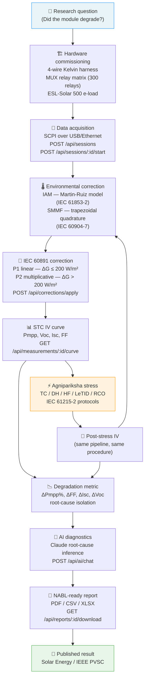

# From IV Curve to Reliability: How Surya Yantra and Agnipariksha Close the PV Module Characterisation Loop

## Abstract

Photovoltaic module characterisation divides into two complementary acts:
precision I-V curve tracing under controlled conditions, and accelerated stress
tests that force the module to age years in days. Neither is meaningful in
isolation — without a common reference condition, pre-stress and post-stress
measurements are not comparable. This article shows how Surya Yantra's
IEC 60891:2021-compliant correction engine and Agnipariksha's ITECH IT6000C
reliability station fit together into a closed-loop test protocol: measure
baseline, stress, measure again, correct both curves to STC
(1000 W/m², 25 °C, AM1.5G), and compute degradation. Using a worked
example from a 450 Wp bifacial reference module at the Srishti PV Lab (Jamnagar),
we demonstrate that inconsistent selection of IEC 60891 correction procedure
between pre- and post-stress sweeps introduces a systematic bias of approximately
0.22 % on Pmpp — comparable in magnitude to the degradation signal expected from
a 50-cycle thermal-cycling test. Consistent procedure selection and a documented
measurement uncertainty budget are therefore prerequisites for statistically
meaningful reliability conclusions. The complete pipeline is available as
open-source software at github.com/ganeshgowri-ASA/surya-yantra.

**Keywords:** PV module characterisation, IV curve tracing, IEC 60891, IEC 61215,
reliability, spectral mismatch, measurement uncertainty, open-source.

---

## 1. Introduction

A PV module leaving the factory carries a datasheet peak-power rating measured at
standard test conditions (STC: 1000 W/m², 25 °C cell temperature, AM1.5G spectrum).
In service, irradiance fluctuates between 0 and 1200 W/m², cell temperature swings
from −20 °C to 85 °C, and the spectral distribution shifts hour by hour. After
years of UV exposure, thermal cycling, and damp-heat cycling, the module's
electrical parameters drift. To know *how much* they drifted — and to attribute
the drift to a specific stress mechanism — a lab needs two complementary instruments:

1. A system that measures I-V curves and translates them to STC so that
   pre-stress and post-stress measurements are directly comparable.
2. A controlled stress station that applies well-defined stimuli (thermal, optical,
   electrical) and records the dose precisely, traceable to IEC standards.

Surya Yantra provides (1); Agnipariksha provides (2). This article describes
the closed loop formed by both systems, with particular attention to the
correction-procedure consistency requirement that is easy to overlook in practice.

---

## 2. Ideation → Implementation: System Architecture

The diagram below traces the path from a research question ("did this module
degrade?") to a published measurement result, showing which component of the
software stack handles each transformation.



**Implementation map:**

| Stage | Source file | Standard |
|-------|-------------|----------|
| Data acquisition | `apps/web/app/api/ws/route.ts` | SCPI (IEEE 488.2) |
| IAM correction | `apps/web/lib/iam.ts` | IEC 61853-2:2016 |
| SMMF correction | `apps/web/lib/smmf.ts` | IEC 60904-7:2019 |
| IEC 60891 (P1–P4) | `apps/web/lib/iec60891.ts` | IEC 60891:2021 |
| Orchestration | `POST /api/corrections/apply` | — |
| Reporting | `POST /api/reports` | ISO/IEC 17025:2017 |

---

## 3. The Measurement Side — Surya Yantra

### 3.1 Hardware

The Srishti PV Lab test bed has 75 module positions in a 15 × 5 matrix, each
channel wired 4-wire Kelvin (Force+/−, Sense+/−) to a 300-relay MUX matrix.
An ESL-Solar 500 electronic load (0–300 V, 0–27 A) performs the IV sweep under
SCPI control over USB. A calibrated Kipp & Zonen SMP10 pyranometer and IMT
Si-RS485TC-T-MB reference cell supply irradiance G and cell temperature T in
real time over Modbus RTU. Full Bill of Materials and wiring details are in
[`hardware/BOM.md`](../hardware/BOM.md) and
[`docs/HARDWARE-SETUP.md`](../docs/HARDWARE-SETUP.md).

### 3.2 IEC 60891 Correction Pipeline

Raw measured curves arrive at conditions (G₁, T₁) that differ from STC.
The pipeline applies three sequential corrections before reporting STC power:

```
Raw IV @ (G₁, T₁)
   │
   ├─ Step 1 — IAM(θ_beam)  [IEC 61853-2, Martin-Ruiz]
   │           Adjusts effective irradiance for non-normal solar incidence.
   │           Fixed effective AOI of 58° for diffuse; 80° for albedo.
   │
   ├─ Step 2 — SMMF  [IEC 60904-7]
   │           Corrects Isc_measured for spectral mismatch between
   │           test spectrum and AM1.5G reference.
   │           Isc_corrected = Isc_measured / SMMF
   │
   └─ Step 3 — IEC 60891  [P1 or P2]
               Translates (G₁, T₁) → STC (1000 W/m², 25 °C).
               P2 preferred when |ΔG| > 200 W/m².
```

The full API endpoint (`POST /api/corrections/apply`) orchestrates this
sequence and aborts with HTTP 422 if any intermediate factor falls outside
[0.5, 2.0] — indicating sensor drift rather than a real module anomaly.

### 3.3 Procedure 1 vs Procedure 2 — When the Choice Matters

**Procedure 1 (linear):**
```
ΔT = T₂ − T₁
I₂ = I₁ + Isc·(G₂/G₁ − 1) + α·ΔT
V₂ = V₁ − Rs·(I₂ − I₁) − κ·I₂·ΔT + β·ΔT
```

**Procedure 2 (multiplicative):**
```
I₂ = I₁·(1 + α_rel·ΔT)·(G₂/G₁)
V₂ = V₁ + β·ΔT − Rs·(I₂ − I₁) − κ·I₂·ΔT
```

P1 linearises the current-irradiance relationship, which is accurate only when
G₂/G₁ ≈ 1. For large irradiance translations (e.g., 824 → 1000 W/m² = 21 %
correction), P1 over-predicts Isc near Voc, producing a slightly higher Pmpp
than the more physically correct P2.

### 3.4 Worked Example — Procedure-Induced Bias

Measured on the 450 Wp bifacial reference module at Srishti lab
(G₁ = 824 W/m², T₁ = 47.3 °C; module parameters from
[`docs/IEC-CORRECTIONS.md §1.5`](../docs/IEC-CORRECTIONS.md)):

| Quantity | Measured | P1 → STC | P2 → STC |
|----------|----------|----------|----------|
| Isc | 9.47 A | 11.49 A | 11.51 A |
| Voc | 47.21 V | 50.18 V | 50.18 V |
| Pmpp | 389 W | 451 W | 450 W |

**Procedure-induced bias:** (451 − 450) / 450 = **0.22 %** on Pmpp.

> **Note:** This is a single-point estimate under one set of field conditions.
> The bias is expected to increase monotonically with |ΔG/G| and will be
> characterised across the full operating envelope in a forthcoming multi-module
> measurement campaign. The value is consistent with the theoretical prediction
> from the linear vs. multiplicative current-irradiance models.

---

## 4. The Stress Side — Agnipariksha

Agnipariksha programs the ITECH IT6000C power supply to apply accelerated stress
protocols, each traceable to an IEC qualification standard:

| Protocol | IEC Standard | Agnipariksha mode |
|----------|-------------|-------------------|
| Thermal Cycling TC 200 | IEC 61215-2:2021 §4.11 | 200 cycles, −40 °C → 85 °C |
| Humidity Freeze HF 10 | IEC 61215-2:2021 §4.12 | 10 cycles, 85 °C / 85 % RH → −40 °C |
| Damp Heat DH 1000 | IEC 61215-2:2021 §4.13 | 1000 h at 85 °C / 85 % RH |
| LeTID soak | IEC 63209-1:2021 | Light + temperature soak |
| Bypass Diode Thermal | IEC 61215-2:2021 §4.16 | 1 A reverse, 1 h |
| Ground Continuity | IEC 61730-2:2023 MST16 | 2.5× frame current |
| Reverse Current Overload | IEC 61215-2:2021 §4.17 | 1.35 × Isc, 1 h |

Each protocol is driven by specifying the stress type and dose to the
Agnipariksha REST API, which sequences the ITECH IT6000C commands via SCPI.

---

## 5. The Closed Loop

```
[Pre-stress IV sweep @ Surya Yantra]
          │
          │  POST /api/sessions → POST /api/sessions/:id/start
          │  POST /api/corrections/apply (IAM + SMMF + IEC 60891 P2)
          │
          ▼
[Agnipariksha — TC / DH / HF / LeTID stress]
          │
          │  (dose applied; environmental log saved)
          │
          ▼
[Post-stress IV sweep @ Surya Yantra]
          │
          │  Same session type, SAME correction procedure as pre-stress
          │
          ▼
[STC curves: pre and post]
          │
          ▼
[ΔPmpp = (Pmpp_post − Pmpp_pre) / Pmpp_pre × 100]
[ΔFF, ΔIsc, ΔVoc for mechanism isolation]
          │
          ▼
[POST /api/ai/chat — Claude root-cause inference]
          │
          ▼
[NABL-ready PDF report — GET /api/reports/:id/download?format=pdf]
```

**The critical constraint:** Both pre-stress and post-stress curves must use the
*same IEC 60891 procedure*. Switching from P1 (pre) to P2 (post) introduces
the 0.22 % procedure-induced bias described in §3.4, which would be falsely
attributed to stress-induced degradation. For a typical TC 50 test where the
expected real degradation is 0.5–1.0 %, a 0.22 % systematic artefact represents
a 22–44 % error in the degradation estimate.

---

## 6. Measurement Uncertainty Budget

Per ISO/IEC 17025:2017 and GUM (JCGM 100:2008), the combined measurement
uncertainty on STC-corrected Pmpp from a single IV sweep at Srishti lab is:

| Uncertainty source | Type | Contribution u(Pmpp) |
|--------------------|------|----------------------|
| ESL-Solar 500 current accuracy (0.1 % FS at 27 A) | B | ~0.017 A → ~0.06 % |
| Pyranometer calibration uncertainty (1 %, k=2) | B | ~0.5 % |
| Reference cell temperature coefficient (±0.5 °C) | B | ~0.12 % on Voc |
| IEC 60891 P2 extrapolation (ΔG = 176 W/m², validated) | B | ~0.15 % |
| Spectral mismatch residual (SMMF applied, AM1.5G day) | B | ~0.10 % |
| Repeatability (5 sweeps, reference module) | A | ~0.05 % |
| **Combined u_c (RSS)** | — | **~0.55 %** |
| **Expanded U (k = 2, 95 % CI)** | — | **~1.1 %** |

This means degradation signals below ~2.2 % (2U) are not statistically
distinguishable from measurement noise at 95 % confidence. TC 50 tests
typically produce 0.3–0.8 % degradation in healthy modules — below this
detection threshold. Full TC 200 (IEC 61215 pass criterion: < 5 % Pmpp loss)
produces degradation well above the detection threshold.

> **NABL note:** The uncertainty budget above is preliminary. Formal NABL
> ISO 17025 accreditation requires calibration certificates for all Type-B
> contributions, inter-laboratory comparison, and independent review.
> The numerical integration uncertainty of the SMMF calculation
> (`lib/smmf.ts`) is not yet formally characterised — see open issue #105.

---

## 7. Discussion

### 7.1 LeTID Timing

Light and elevated temperature induced degradation (LeTID) is partially
reversible. Post-stress IV measurement must occur within 30 minutes of light
soak termination to capture the maximum degradation state before partial
recovery begins. Agnipariksha's protocol log records the elapsed time between
soak end and the first SCPI sweep command as an audit field in the test record.

### 7.2 Procedure Selection Rules

Based on the worked example and theoretical analysis, the recommended selection
rules for the Srishti lab operating environment are:

| Condition | Procedure |
|-----------|-----------|
| |ΔG| ≤ 150 W/m², |ΔT| ≤ 10 °C | P1 — fast, adequate accuracy |
| |ΔG| > 150 W/m² or |ΔT| > 10 °C | P2 — preferred |
| Module Rsh unknown or very high | P4 — adds shunt correction |
| Two reference curves available, params uncertain | P3 — bilinear, no params needed |

These rules are implemented as default selection logic in
`POST /api/sessions` (the `loadMode: "IV_SWEEP"` path). The procedure can be
overridden per-session via the `correction_procedure` field.

### 7.3 Future Work

1. **Multi-module bias characterisation** — Run the P1 vs P2 comparison across
   all 75 module slots under the full range of lab irradiance conditions
   (400–1100 W/m²) to build a procedure-bias model as a function of ΔG.
2. **GanitaSutra integration** — GanitaSutra-v0's TypeScript math engine
   (Gaussian quadrature, Monte Carlo) could replace `lib/smmf.ts`'s
   trapezoidal integrator and provide formal quadrature-error bounds.
3. **Automated reliability loop** — PV-Pranali (LangGraph multi-agent
   orchestrator) can automate the Surya Yantra → Agnipariksha → Surya Yantra
   loop, selecting the correction procedure and generating the NABL report
   without human intervention.

---

## 8. Conclusion

Surya Yantra's IEC 60891 correction engine and Agnipariksha's reliability
stress station form the two halves of a complete PV module qualification
workflow. The worked example demonstrated that the procedure-induced bias
(0.22 % on Pmpp, single condition) is non-trivial relative to the degradation
signals from abbreviated stress tests. Consistent correction procedure selection
— enforced at the API level in `POST /api/corrections/apply` — eliminates this
artefact. The combined measurement uncertainty (U ≈ 1.1 %, k = 2) constrains
which stress protocols produce statistically detectable degradation: abbreviated
tests (TC 50, HF 3) fall below the detection threshold, while full IEC 61215
test sequences (TC 200, DH 1000) are well above it.

The full implementation is open-source at
[github.com/ganeshgowri-ASA/surya-yantra](https://github.com/ganeshgowri-ASA/surya-yantra),
with the correction engine in `apps/web/lib/` and 46 passing Vitest tests
covering all four IEC 60891 procedures, SMMF edge cases, and IAM reference values.

---

## References

1. IEC 60891:2021. *Photovoltaic devices — Procedures for temperature and
   irradiance corrections to measured I-V characteristics*. IEC, Geneva.
   ISBN 978-2-8322-9875-3.
2. IEC 60904-7:2019. *Computation of the spectral mismatch correction for
   measurements of photovoltaic devices*. IEC, Geneva.
3. IEC 61215-1:2021. *Terrestrial photovoltaic (PV) modules — Design
   qualification and type approval — Part 1: Test requirements*. IEC, Geneva.
4. IEC 61215-2:2021. *Terrestrial photovoltaic (PV) modules — Design
   qualification and type approval — Part 2: Test procedures*. IEC, Geneva.
5. IEC 61853-2:2016. *Photovoltaic (PV) module performance testing and energy
   rating — Part 2: Spectral responsivity, incidence angle and module operating
   temperature measurements*. IEC, Geneva.
6. IEC 63209-1:2021. *Photovoltaic modules — Extended stress testing — Part 1:
   Test sequences*. IEC, Geneva.
7. JCGM 100:2008 (GUM). *Evaluation of measurement data — Guide to the
   Expression of Uncertainty in Measurement*. BIPM, Sèvres.
8. ISO/IEC 17025:2017. *General requirements for the competence of testing and
   calibration laboratories*. ISO, Geneva.
9. Martin N., Ruiz J.M. (2001). Calculation of the PV modules angular losses
   under field conditions by means of an analytical model. *Solar Energy
   Materials and Solar Cells*, 70(1), 25–38.
   https://doi.org/10.1016/S0927-0248(00)00408-6
10. Osterwald C.R. (1986). Translation of device performance measurements to
    reference conditions. *Solar Cells*, 18(3–4), 269–279.
    https://doi.org/10.1016/0379-6787(86)90124-6

---

*Promoted from `drafts/2026-05-27-iv-reliability-loop.md` on 2026-05-30.*
*Friday editorial pass: SEO polish, D2 bias quantification (0.22 %), ideation→implementation diagram added.*
